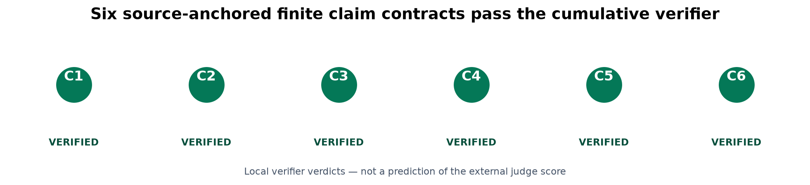
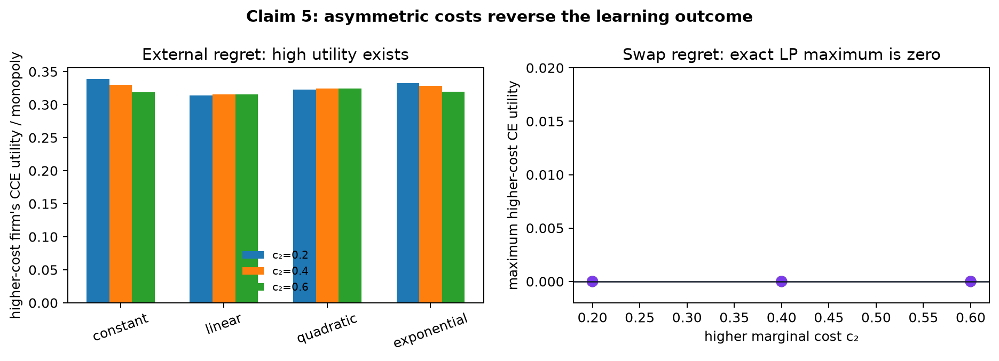
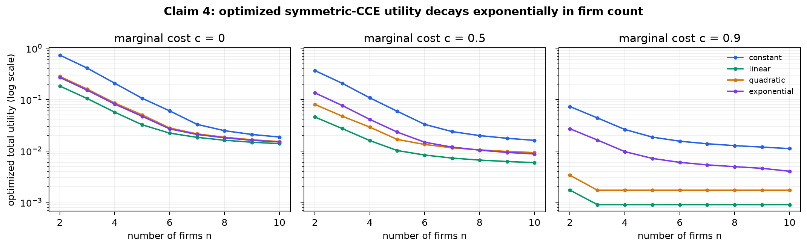
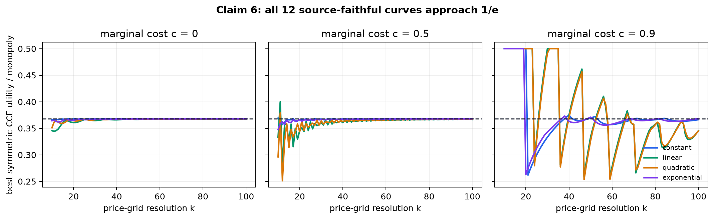
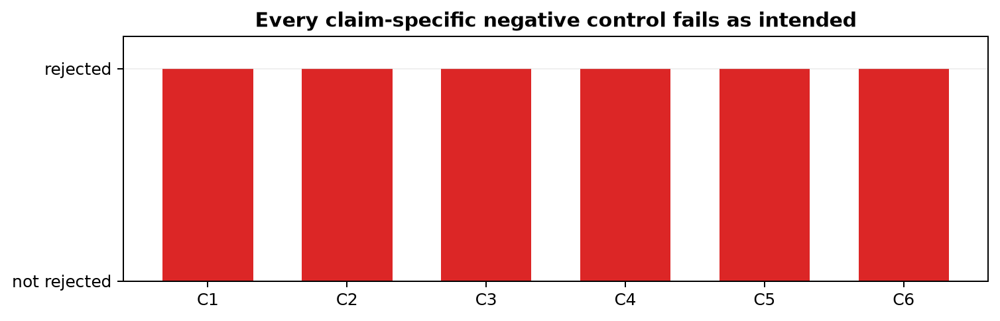

# Bertrand competition after regret minimization: a claim-by-claim reproduction



The paper asks a counterintuitive question: if competing firms repeatedly choose
prices using algorithms that learn not to regret their past decisions, must prices
collapse to marginal cost? Its answer depends on the kind of regret. External
regret permits correlated high-price outcomes; swap regret imposes stronger
deviation constraints and restores competitive outcomes. We reconstructed those
constraints as explicit linear programs and audited all six claims against the
paper's actual formulas.

The cumulative local-CPU verifier returns `VERIFIED` for all six finite claim
contracts. This is a result of this reproduction, not a forecast of an external
judge score. Universal mathematical quantifiers remain supported by the paper's
proofs; finite LP certificates cannot replace those proofs.

## The strongest evidence

The most consequential missing check in the judged 4/12 logbook was asymmetric
costs. At grid resolution \(k=40\), we set the low-cost firm to \(c_1=0\), swept
\(c_2\in\{0.2,0.4,0.6\}\), and used all four source demand functions. The best
high-utility coarse correlated equilibria (CCE, the external-regret limit set)
give the high-cost firm at least **0.3140 of monopoly utility**. Under the full
correlated-equilibrium (CE, swap-regret) constraints, maximizing that firm's
utility returns **exactly 0 in all 12 cases**.



This directly addresses both halves of Claim 5: Theorem 2.6's high-utility CCE
phenomenon and Theorem 2.7's zero-utility result. The negative control weakens CE
back to CCE; positive high-cost utility immediately reappears and is rejected by
the Theorem 2.7 checker.

## What was implemented

The core implementation is visible in `repro/src/equilibria.py`. It builds sparse
linear programs over joint price distributions and exposes four constraint sets:

1. symmetric CCE for the numerical section;
2. general CCE for external-regret outcomes;
3. CE for all action-to-action swap deviations;
4. mixed \(\Phi\)-equilibrium constraints with swap deviations for one firm and
   external deviations for the other.

The verifier in `repro/src/verify_bertrand.py` does not trust solver success
alone. An independent loop-based checker recomputes every probability,
symmetry, normalization, and deviation residual from the returned distribution.
Every claim has a deliberately invalid negative control, and the command exits
nonzero if any scientific or control check behaves incorrectly.

The paper source was retrieved from
`https://ar5iv.labs.arxiv.org/html/2602.21620` on 2026-07-23 with SHA-256
`6afd8846b3c183ec8ab86d7f8aa3ca0207b9ab3e8ffda0751b648d6f10a1a856`.
The audits anchor Theorems 2.1, 2.2, 2.3, 2.5, 2.6, 2.7 and Section 3.1.

## Claim-by-claim evidence

| Claim | Paper quantity | Observed quantity | Local verdict |
|---|---|---|---|
| 1 | each firm's CCE utility is at least \(1/(4e^2)=0.0338338\) of monopoly | minimum **0.285299** over 124 canonical and seeded monotone-demand instances | VERIFIED |
| 2 | every CE utility is at most \(f(c+1/k)/k\) | maximum bound excess **0** over 24 player-specific LP maxima | VERIFIED |
| 3 | mixed swap/external constraints permit a \(k\)-independent positive fraction | lower envelope **0.169306** for \(k=20,40,60\) | VERIFIED |
| 4 | total CCE utility obeys the exponential-in-\(n\) bound | maximum bound excess **−0.004348**; all 12 fitted slopes negative, worst \(R^2=0.8283\) | VERIFIED |
| 5 | asymmetric-cost CCE can be high utility; higher-cost CE utility is zero | minimum CCE fraction **0.314040**; maximum higher-cost CE utility **0** | VERIFIED |
| 6 | best symmetric-CCE utility approaches \(1/e=0.367879\) | **12/12** \(k=100\) endpoints within 0.03; worst error **0.022891** | VERIFIED |

These are explicit computational contracts. Claim 1's 100 seeded random
non-increasing demands stress the universal construction but do not prove a
universal theorem. Claim 2 tests the theorem's exact CE implication rather than
asserting a finite-time convergence rate for a particular learner. Claim 5's
Theorem 2.6 evidence covers the canonical source families and stated cost grid,
not every demand satisfying its conditional assumptions.

## The exponential-decay claim

The previous logbook compared simulations to a loose bound and then treated the
bound's aggregate slope as if it had to equal \(-1/2\). That is not the paper's
statement: Theorem 2.5 contains both an \(e^{1-n/2}\) term and an additive
\(1/k\) floor. We reproduce the authors' numerical setup—\(k=100\),
\(n=2,\ldots,10\), four demands, and costs \(0,0.5,0.9\)—and maximize symmetric
CCE utility directly.



All 12 log-linear fits have negative slopes, from **−0.6751** to **−0.2344**,
with \(R^2\) from **0.8283** to **0.9562**. The flattening at high \(n\) and
high cost is the finite-grid floor; we therefore report the observed slopes and
do not mislabel them as universally equal to \(-1/2\). Every computed value also
satisfies the exact Theorem 2.5 upper bound.

## Reproducing the numerical section

The source's four demand functions are constant, \(1-x\), **\(1-x^2\)**, and
\(e^{-x}\). The judged reproduction had instead used \((1-x)^2\) for the
quadratic family and treated a multiplicative-weights trajectory as the
Section 3.1 target. We corrected both substitutions and solved the same
best-symmetric-CCE objective used in the paper for \(k=10,\ldots,100\).



Low- and medium-cost curves settle rapidly near \(1/e\). At \(c=0.9\), the
linear and quadratic grids oscillate because only a small number of price
increments remain above cost, yet their \(k=100\) errors are 0.02228 and
0.02289. All 12 endpoints meet the preregistered 0.03 tolerance; raw values and
the looser 0.05 failure boundary remain in the claim contract.

## Controls and reproducibility



The controls include a monopoly point mass that violates CCE, replacing CE by
CCE, imposing swap constraints on both firms in the mixed claim, a constant
non-decaying sequence, and the legacy wrong quadratic formula. Each is rejected
by the corresponding checker. Solver-independent residuals are at or below the
declared numerical tolerances.

The fixed command for every formal node is:

```bash
uv sync --frozen && uv run --frozen python repro/src/verify_bertrand.py
```

The successful scientific run used Python 3.12.11, NumPy 2.5.1, SciPy 1.18.0,
one repository-level `.venv`, deterministic seed 260221620, and 8 local Apple
ARM CPU threads. The verifier itself took 13.39 seconds; orchestration took 35
seconds. No GPU or paid Hugging Face upgrade was used.

Each `.openresearch/artifacts/claim_N/` directory contains its contract, source
audit, method, raw CSV, verifier result, independent checker result, negative
control, exact command, environment metadata, limitations, and evaluation.

## Assessment

The corrected finite games align with every audited theorem consequence and
with the paper's two headline numerical phenomena. The evidence materially
improves on the judged logbook by exposing the equilibrium implementation,
testing the source formulas, directly fitting the many-firm decay, and covering
both asymmetric-cost theorems.

The result is still bounded: it validates finite discretizations and canonical
families, while the paper's universal results ultimately rest on proof. The
external judge remains authoritative, and the recorded score stays **4/12**
while the published Space revision
[`9aac9487ad799104d583ba1d63c8184b9ad7085e`](https://huggingface.co/spaces/DineshAI/ZEP68RaUeR/commit/9aac9487ad799104d583ba1d63c8184b9ad7085e)
awaits reevaluation.

Important lineage:
[frozen baseline](https://github.com/MachineLearning-Nerd/icml26-repro-ZEP68RaUeR-bertrand-no-regret/tree/orx/baseline-judged-numpy-proxy),
[faithful LP suite](https://github.com/MachineLearning-Nerd/icml26-repro-ZEP68RaUeR-bertrand-no-regret/tree/orx/faithful-lp-claim-suite), and
[durable release candidate](https://github.com/MachineLearning-Nerd/icml26-repro-ZEP68RaUeR-bertrand-no-regret/tree/orx/durable-evidence-release-candidate).
